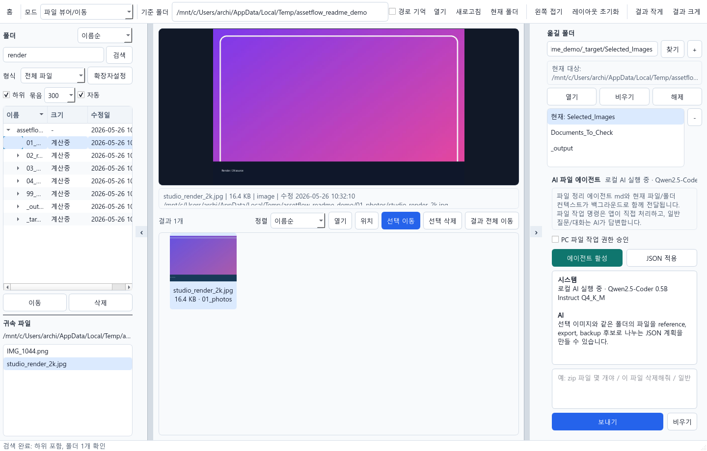
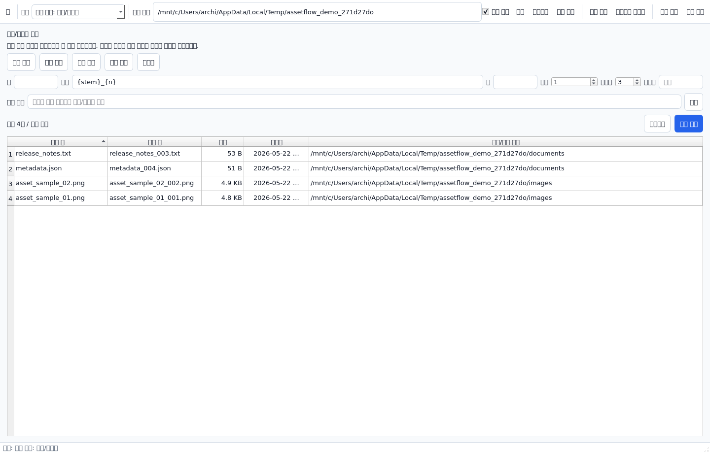
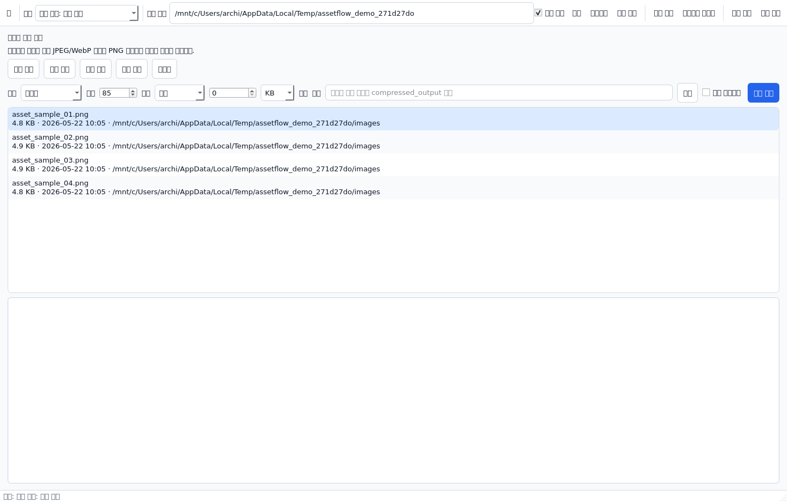
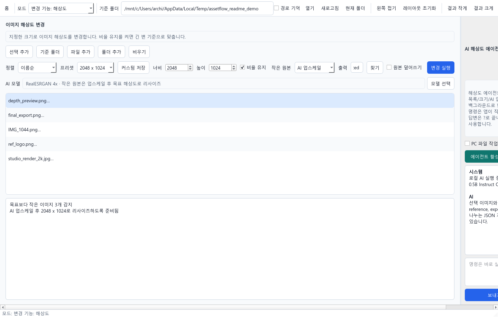
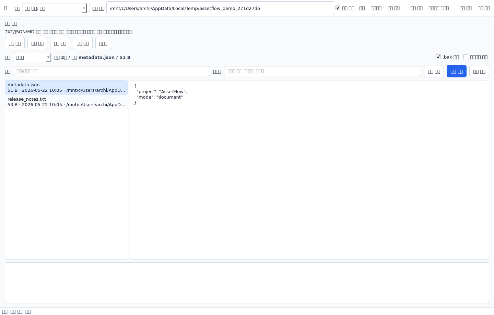

# AssetFlow

AssetFlow는 로컬 PC의 파일, 이미지, 문서를 빠르게 확인하고 정리하는 Windows용 데스크톱 도구입니다.

> Source code is managed privately. This public repository is for product information, screenshots, license notices, and Windows installer downloads.

## 다운로드

[Windows 설치 파일 다운로드](https://github.com/Suwook90/assetflow/releases/latest/download/AssetFlowSetup.exe)

최신 릴리스 페이지:
https://github.com/Suwook90/assetflow/releases/latest

현재 공개 버전:
https://github.com/Suwook90/assetflow/releases/tag/v0.1.1

## 주요 기능

- 폴더 안의 파일과 이미지를 한 화면에서 미리보기
- 왼쪽 폴더 목록, 중앙 미리보기/결과 그리드, 오른쪽 이동 대상 폴더 패널
- 다중 선택, 드래그 선택, `Del`, `F2`, 우클릭 메뉴 지원
- 이미지 뷰어/이동, 이름/확장자 변경, 이미지 용량 압축, 이미지 해상도 변경, 문서 변경 모드
- 문서 변경 모드에서 일괄 단어 변경, 개별 편집/저장, 목록 비우기와 실제 삭제 지원
- JPG, PNG, WebP, HDR, EXR, TXT, JSON 등 다양한 파일 형식 확인
- EXR depth map 흑백 미리보기, 큰 폴더 순차 로딩, 대상 폴더 저장

## 화면 미리보기

| 모드 선택 | 파일 뷰어/이동 |
| --- | --- |
|  |  |

| 이름/확장자 변경 | 이미지 용량 압축 |
| --- | --- |
|  |  |

| 이미지 해상도 변경 | 문서 변경 |
| --- | --- |
|  |  |

## 설치 안내

1. [AssetFlowSetup.exe](https://github.com/Suwook90/assetflow/releases/latest/download/AssetFlowSetup.exe)를 다운로드합니다.
2. 설치 파일을 실행합니다.
3. Windows SmartScreen 경고가 뜨면 `추가 정보` 후 실행을 선택합니다.
4. 시작 메뉴 또는 바탕화면의 `AssetFlow` 바로가기로 실행합니다.

현재 설치 파일은 코드 서명 인증서로 서명되지 않았기 때문에 Windows SmartScreen 경고가 표시될 수 있습니다.

## 라이선스

Copyright (c) 2026 archi.

AssetFlow는 [PolyForm Noncommercial License 1.0.0](https://polyformproject.org/licenses/noncommercial/1.0.0/)으로 배포됩니다.

- 개인, 교육, 연구, 비영리 목적의 사용을 허용합니다.
- 상업적 사용은 허용하지 않으며, 상업적 사용이 필요하면 저작권자에게 별도 허가를 받아야 합니다.
- 재배포할 때는 `LICENSE`와 `NOTICE`를 함께 포함해 주세요.

SPDX-License-Identifier: `PolyForm-Noncommercial-1.0.0`
