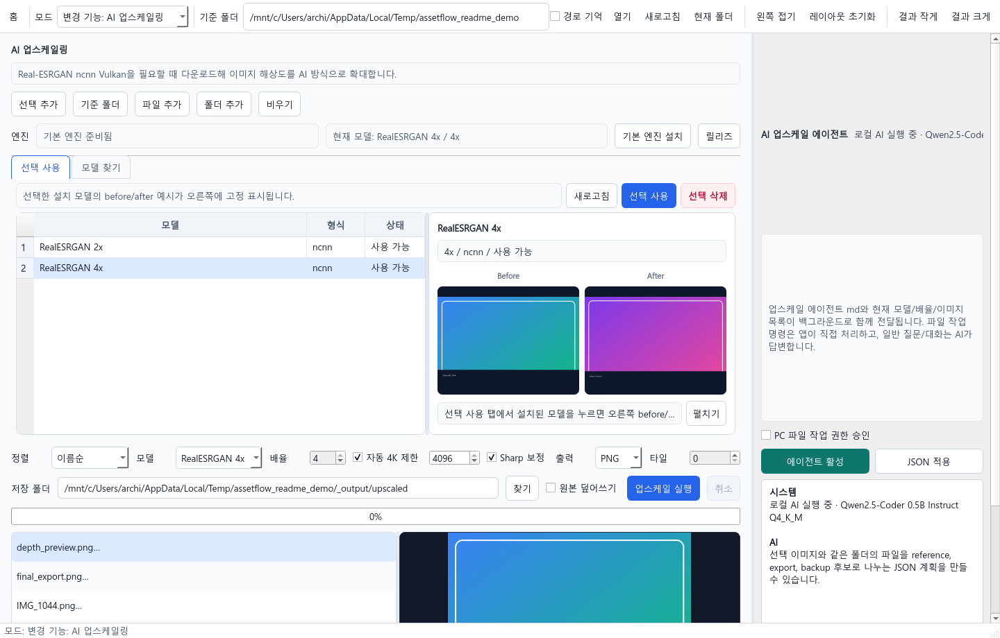
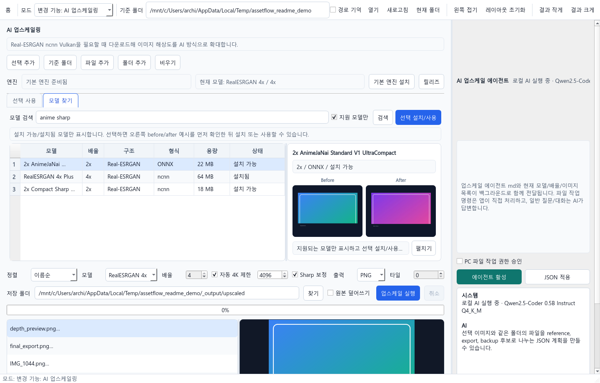
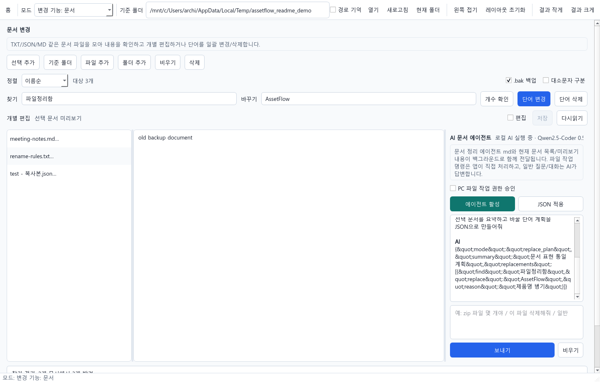
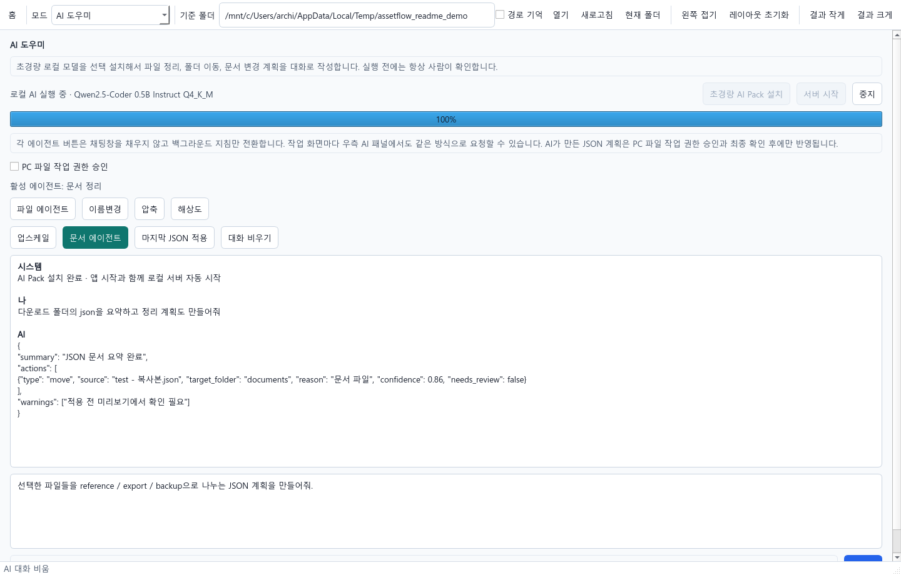

# 파일정리함 (AssetFlow)

파일정리함은 로컬 PC의 파일, 이미지, 문서를 한 화면에서 보고 정리하는 Windows용 데스크톱 프로그램입니다. 폴더 이동, 이름/확장자 변경, 이미지 압축, 해상도 변경, AI 업스케일링, 문서 편집, 로컬 AI 에이전트 작업을 한 앱 안에서 처리합니다.

`파일정리함`은 사용자에게 보이는 한글 제품명이고, `AssetFlow`는 다운로드 파일명과 GitHub URL에 남겨 둔 영문 코드명입니다.

> 이 공개 저장소는 소개, 스크린샷, 라이선스, Windows 설치 파일 다운로드용입니다. 소스코드는 비공개 저장소에서 관리합니다.

## 다운로드

[Windows 설치 파일 다운로드](https://github.com/Suwook90/assetflow/releases/download/v1.1.2/AssetFlowSetup.exe)

- 최신 릴리스: https://github.com/Suwook90/assetflow/releases/latest
- 현재 공개 버전: `1.1.2`
- 설치 파일명: `AssetFlowSetup.exe`

현재 설치 파일은 코드 서명 인증서로 서명되지 않아 Windows SmartScreen 경고가 표시될 수 있습니다. 경고가 뜨면 `추가 정보` 후 실행을 선택하면 됩니다.

## 화면 미리보기

| 모드 선택 | 파일 뷰어/이동 |
| --- | --- |
|  |  |

| 이름/확장자 변경 | 이미지 용량 압축 |
| --- | --- |
|  |  |

| 이미지 해상도 변경 | AI 업스케일링 모델 선택 |
| --- | --- |
|  |  |

| 업스케일 모델 찾기 | 문서 변경/AI 문서 에이전트 |
| --- | --- |
|  |  |

| 로컬 AI 도우미 |
| --- |
|  |

## 주요 기능

- 파일 뷰어/이동: 왼쪽 폴더 트리, 중앙 미리보기/검색 결과, 오른쪽 대상 폴더 패널로 빠르게 정리
- 대상 폴더 목록 저장: 자주 쓰는 이동 대상 폴더를 저장하고 클릭으로 현재 대상 전환
- 다중 선택: `Ctrl`/`Shift` 선택, 드래그 박스 선택, `Del`, `F2`, 우클릭 메뉴 지원
- 이름/확장자 변경: 단어 변경, 단어 삭제, 규칙 토큰, 번호 붙이기, 강제 확장자 변경
- 이미지 용량 압축: KB/MB 기준 이상 파일만 압축, 품질 설정, 원본 덮어쓰기 또는 출력 폴더 저장
- 이미지 해상도 변경: 256/512/1024/2048 프리셋과 커스텀 프리셋, 작은 원본 처리 방식 선택
- 문서 변경: TXT/JSON/MD/CSV 등 문서 미리보기, 개별 편집/저장, 단어 일괄 변경/삭제
- HDR/HDRI/EXR 미리보기: RGB 없는 depth map EXR은 흑백 로그 스트레치로 확인
- 큰 폴더 대응: 300개 우선 로드, 백그라운드 순차 로딩, 보이는 썸네일 우선 로딩

## AI 업스케일링

- Real-ESRGAN ncnn Vulkan 업스케일러를 로컬 캐시에 자동 준비합니다.
- 기본 모델은 `RealESRGAN 2x`, `RealESRGAN 4x` 중심으로 구성됩니다.
- 1K/2K/4K 자동 제한과 Sharp 후처리를 지원합니다.
- `선택 사용` 탭에서 설치된 모델을 고르면 오른쪽에 before/after 미리보기가 표시됩니다.
- `모델 찾기` 탭에서 OpenModelDB 기반 모델을 검색하고, 현재 앱이 실행 가능한 모델만 설치/사용할 수 있습니다.
- ncnn용 `.bin + .param` 모델과 유효한 `.onnx` 모델을 지원합니다.
- `.pth`, `.safetensors`는 현재 앱 실행 백엔드에서 직접 처리하지 않아 검색/설치 대상에서 제외합니다.

## 로컬 AI 에이전트

- AI Pack은 선택형으로 동작하며, 앱 실행 후 로컬 캐시에 준비됩니다.
- 파일 이동/삭제/복사/이름변경 같은 파일 작업 명령은 LLM으로 넘기지 않고 앱이 직접 해석합니다.
- 실제 파일 변경은 PC 파일 작업 권한 승인과 확인창을 거친 뒤 실행됩니다.
- 일반 질문이나 대화는 `?`가 없어도 로컬 AI가 답변할 수 있습니다.
- `zip 파일 몇 개야`, `압축파일 몇 개야`, `그중 제일 큰 파일은?` 같은 파일 정보 질문은 앱이 실제 폴더를 스캔해 답합니다.
- `파일 삭제해줘`, `폴더 이동해줘`, `폴더명 바꿔줘` 같은 명령은 실제 경로 확인 후 처리합니다.
- Windows 핵심 경로와 드라이브 루트 등 위험한 경로는 자동 차단합니다.

## 설치 안내

1. [AssetFlowSetup.exe](https://github.com/Suwook90/assetflow/releases/download/v1.1.2/AssetFlowSetup.exe)를 다운로드합니다.
2. 설치 파일을 실행합니다.
3. 시작 메뉴 또는 바탕화면의 `파일정리함` 바로가기로 실행합니다.
4. AI 업스케일링이나 AI 에이전트를 처음 사용할 때 필요한 런타임/모델은 로컬 캐시에 준비됩니다.

## 저장소 구성

- `Suwook90/assetflow`: 공개 다운로드/소개용 저장소입니다. 소스코드는 포함하지 않습니다.
- `Suwook90/assetflow-private`: 비공개 소스/빌드 작업용 저장소입니다.

## 라이선스

Copyright (c) 2026 Suwook90.

파일정리함(AssetFlow)은 [PolyForm Noncommercial License 1.0.0](https://polyformproject.org/licenses/noncommercial/1.0.0/)으로 배포됩니다.

- 개인, 교육, 연구, 비영리 목적의 사용을 허용합니다.
- 상업적 사용은 허용하지 않으며, 상업적 사용이 필요하면 저작권자에게 별도 허가를 받아야 합니다.
- 재배포할 때는 `LICENSE`와 `NOTICE`를 함께 포함해 주세요.

SPDX-License-Identifier: `PolyForm-Noncommercial-1.0.0`
